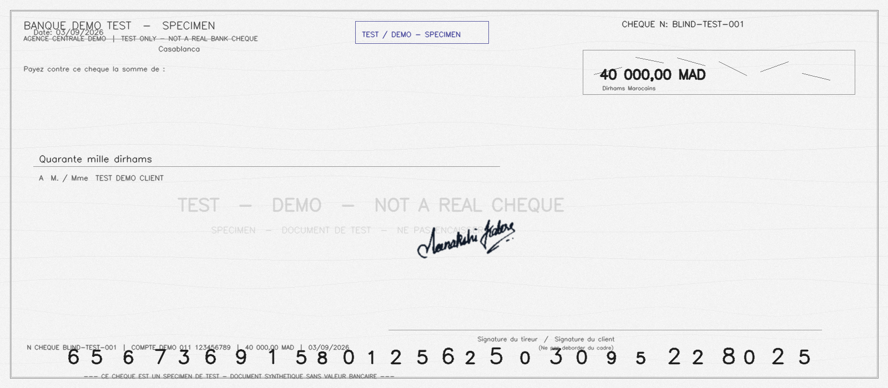
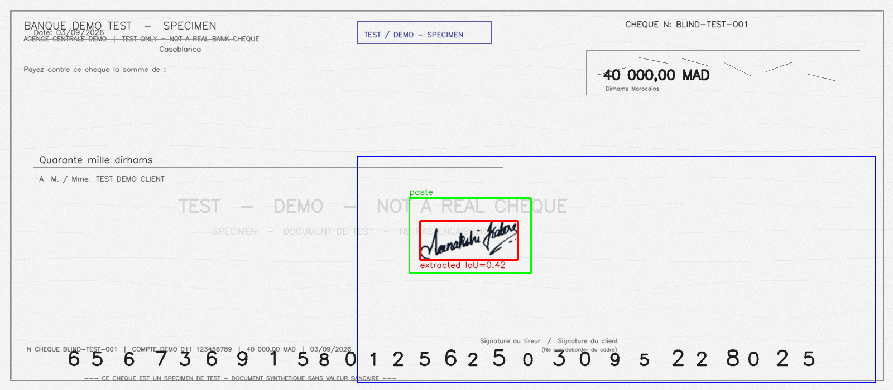
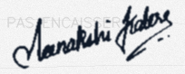

# ChequeVerificationPlatform


-EE4C2C?logo=pytorch&logoColor=white)


Bank-cheque verification platform combining an **ASP.NET Core web application** with a **Python FastAPI analysis microservice**: cheque OCR (CMC7 + PaddleOCR), experimental signature extraction and comparison (OpenCV baseline + learned Siamese metric), a dual-threshold decision policy with human-in-the-loop manual review, and role-based dashboards.

> **Status: experimental / internship project.** Similarity scores are technical measures, not banking verdicts. No threshold is applied inside the analysis service — the accept / review / reject decision lives in the web app's configurable policy and ambiguous cases are routed to human reviewers.

## Demo

Synthetic demo cheque → extraction diagnostic (ROI + MICR risk band + final bbox) → isolated signature crop:

| Input (synthetic) | Extraction diagnostic | Signature crop |
|---|---|---|
|  |  |  |

All demo images are generated by scripts in [`artifacts/manual-demo`](artifacts/manual-demo) and watermarked "NOT A REAL CHEQUE". More samples and ground-truth files live in the same folder.

## Features

- **Cheque management** — upload, batch import (images + CMC7), cheque details with OCR results.
- **Cheque OCR** — CMC7 magnetic-line parsing (cheque number, bank code, account, key) plus full-text OCR via a PaddleOCR worker.
- **Signature extraction (experimental)** — OpenCV pipeline over a configurable relative ROI: Otsu binarization, small morphological close, connected components, relative-area filtering, geometric MICR/printed-text rejection in a risk band, spatial grouping and dominant-core refinement, with a quality heuristic and dev-only visual diagnostics.
- **Signature comparison (experimental)** — OpenCV baseline (mask IoU + normalized correlation + density, fixed canvas 256×128) and an AI metric endpoint (cosine similarity of 128-D Siamese ResNet18 embeddings). Raw scores only, no decisions.
- **Decision policy** — dual thresholds (`LowerThreshold` / `UpperThreshold`): below lower → reject, above upper → accept, in between → manual review queue. Thresholds used are persisted per verification for auditability.
- **Manual review** — reviewer queue with approve/reject decisions, all actions audit-logged.
- **Reference signatures** — per-customer enrollment, multi-reference aggregation (max / mean / median / top-2 mean).
- **Dashboards** — separate Admin, Controller and User views with KPIs, history and audit trail.
- **Auth & roles** — ASP.NET Identity-style password hashing with Admin / Controller / User roles.

## Architecture

```
Browser
  │
  ▼
┌──────────────────────────────┐      HTTP (localhost)       ┌─────────────────────────────┐
│  ASP.NET Core MVC (.NET 10)  │ ──────────────────────────▶ │  FastAPI verification-api   │
│  src/ChequeVerification.Web  │ ◀────────────────────────── │  services/verification-api  │
│                              │      JSON + base64 images   │                             │
│  Controllers / Services /    │                             │  routes: health, images,    │
│  EF Core (SQL Server) /      │                             │  cheques/ocr, signatures    │
│  Razor views + dashboards    │                             │  (extract, compare,         │
└──────────────────────────────┘                             │  compare-ai, debug)         │
                                                             └──────────────┬──────────────┘
                                                                            │ HTTP
                                                                            ▼
                                                             ┌─────────────────────────────┐
                                                             │  PaddleOCR worker (Docker)  │
                                                             │  ocr-worker/ (Linux, :8010) │
                                                             └─────────────────────────────┘
```

| Component | Path | Tech |
|---|---|---|
| Web app (UI, workflow, decisions, persistence) | `src/ChequeVerification.Web` | ASP.NET Core MVC, .NET 10, EF Core + SQL Server |
| Analysis microservice (OCR, signatures, AI) | `services/verification-api` | Python 3.12+, FastAPI, OpenCV, PyTorch (optional) |
| OCR worker (PaddleOCR runtime) | `services/verification-api/ocr-worker` | Docker Linux, PaddlePaddle CPU, PaddleOCR |
| AI research (Siamese metric, CEDAR, writer-independent) | `services/verification-api/ai` | PyTorch, ResNet18, contrastive loss |
| Tests | `tests/ChequeVerification.Web.Tests`, `services/verification-api/tests` | xUnit, pytest |
| Experiments & artifacts | `experiments/`, `artifacts/` | Benchmarks, demo generators, reports |

### Verification workflow

1. Cheque image uploaded (single or batch) → stored under `wwwroot/uploads/` (gitignored, created at runtime).
2. Web app calls the FastAPI service: CMC7 parse → OCR → signature extraction → comparison against enrolled reference(s).
3. Scores aggregated (multi-reference) into a mean score; the **decision policy** maps it to accept / manual-review / reject using the configured thresholds (defaults `0.6585` / `0.9150`).
4. Reviewers resolve ambiguous cases; every decision, score and threshold used is persisted (`VerificationResult`, `SignatureComparison`, `AuditLog`).

### Signature AI (research track)

- Writer-independent Siamese ResNet18 trained on CEDAR (55 writers, writer-level 70/15/15 split, seed 42) with contrastive loss; threshold selected on validation, test writers unseen.
- Served optionally via `/api/signatures/compare-ai` from a versioned checkpoint (`ai_metric_v2`, embedding 128-D, canvas 256×128). Without PyTorch or with the feature disabled, the API still runs and the endpoint returns a controlled 503 while the OpenCV baseline keeps working.
- Checkpoints, datasets and reports are **not** stored in this repo (see `.gitignore`).

## Getting started

### Prerequisites

| Tool | Version | Notes |
|---|---|---|
| [.NET SDK](https://dotnet.microsoft.com/download) | 10 | Web app + xUnit tests |
| [SQL Server](https://www.microsoft.com/sql-server/sql-server-downloads) | any recent | Local `SQLEXPRESS` works; connection string in `appsettings.Development.json` |
| [Python](https://www.python.org/downloads/) | 3.12+ | Analysis API |
| [Docker](https://docs.docker.com/get-docker/) | any recent | Only for the PaddleOCR worker (optional but recommended for OCR) |

### Quickstart (5 steps, ~10 min)

```powershell
# 1. Analysis API
cd services/verification-api
python -m venv .venv
.\.venv\Scripts\activate
pip install -r requirements.txt
# Optional, only for POST /api/signatures/compare-ai:
pip install -r requirements-ai.txt
copy .env.example .env
uvicorn app.main:app --host 0.0.0.0 --port 8000 --reload
```

✅ Verify: open `http://localhost:8000/api/health` → `{"status":"ok",...}`.

```powershell
# 2. OCR worker (new terminal, optional but recommended)
cd services/verification-api
docker compose -f docker-compose.ocr.yml up --build
```

✅ Verify: the API proxies OCR to `http://127.0.0.1:8010` (`OCR_WORKER_URL` in `.env`). Without the worker, OCR endpoints fail but extraction/comparison still work.

```powershell
# 3. Web app (new terminal, from repo root)
dotnet run --project src/ChequeVerification.Web
# → http://localhost:5285
```

✅ Verify: home page loads, register/login works, uploading a cheque image runs the pipeline.

```powershell
# 4. Run the tests (proves your setup is healthy)
dotnet test tests/ChequeVerification.Web.Tests
cd services/verification-api
.\.venv\Scripts\python.exe -m pytest tests/ -q
```

### Troubleshooting

- **Paddle import fails on Windows** (`DLL load failed while importing libpaddle`) — expected: Windows native Paddle is blocked by Smart App Control. Use the Docker worker (step 2); nothing on Windows needs changing.
- **`/api/signatures/compare-ai` returns 503** — not a bug: the AI service is disabled, PyTorch is missing, or the checkpoint path is wrong. Check `SIGNATURE_AI_ENABLED` and `GET /api/signatures/ai-status`. The OpenCV baseline is unaffected.
- **Signature bbox misses the signature** — the default ROI assumes bottom-right placement. Run in `APP_ENV=development`, open the extraction diagnostic (`POST /api/signatures/debug`), and calibrate `SIGNATURE_ROI_*` in `.env` for your cheque format.
- **Web app can't reach the API** — check `VerificationApi:BaseUrl` in `appsettings.Development.json` (default `http://localhost:8000`) and that uvicorn is running.
- **DB errors on first run** — EF Core migrations live in `src/ChequeVerification.Web/Migrations`; ensure SQL Server is reachable with the configured connection string.

## Configuration highlights

| Setting | Default | Meaning |
|---|---|---|
| `VerificationPolicy:LowerThreshold` | `0.6585` | At/below → reject |
| `VerificationPolicy:UpperThreshold` | `0.9150` | At/above → accept (between → manual review) |
| `SIGNATURE_ROI_*` | bottom-right ratios | Candidate signature zone (relative 0..1, calibrate per cheque format) |
| `SIGNATURE_*` (filtering, MICR, grouping, core) | see `.env.example` | All thresholds relative to the ROI, never fixed pixels |
| `SIGNATURE_AI_ENABLED` / `SIGNATURE_AI_CHECKPOINT` | `true` / `ai/checkpoints/metric_resnet18_v2.pt` | Learned-metric comparison |
| `OCR_WORKER_URL` | `http://127.0.0.1:8010` | PaddleOCR Docker worker |

Full endpoint documentation (with examples) is in [`services/verification-api/README.md`](services/verification-api/README.md); AI training details in [`services/verification-api/ai/README.md`](services/verification-api/ai/README.md).

## Tests

```powershell
# .NET (from repo root)
dotnet test tests/ChequeVerification.Web.Tests
# Python API (CMC7, OCR, extraction, comparison, AI)
cd services/verification-api
.\.venv\Scripts\python.exe -m pytest tests/ -q
```

## Repository structure

```
├── src/ChequeVerification.Web/   # MVC app: Controllers, Services, Data (EF), Views, wwwroot
├── services/verification-api/    # FastAPI: app/ (routes, services, schemas, core), ai/, ocr-worker/, tests/
├── tests/ChequeVerification.Web.Tests/  # xUnit suite
├── experiments/                  # Benchmarks (Leadtools CMC7, supervisor signature, demo cases)
├── artifacts/                    # Demo generators, sample outputs, phase reports
├── ChequeVerificationPlatform.slnx
└── .gitignore                    # venvs, build output, uploads, checkpoints, secrets
```

## Data & privacy

This public repo contains **no real customer data**: cheque/signature images in `artifacts/` are synthetically generated (watermarked "NOT A REAL CHEQUE"), account numbers in test fixtures are zeroed format-preserving placeholders, and runtime uploads, local databases (`.db`/`.sqlite`), virtualenvs, model checkpoints and `.env` files are gitignored. Real credentials, connection strings and secrets must never be committed — only `.env.example` (secret-free) is tracked.

## License

No license selected yet — all rights reserved by default. Add one (e.g. MIT) if you want others to reuse this code.
